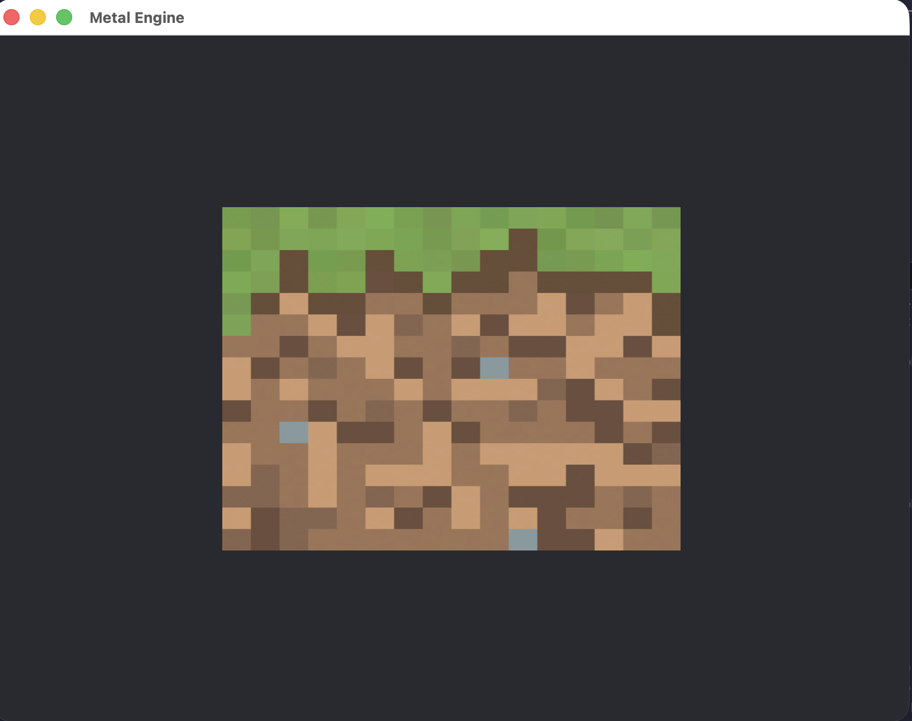
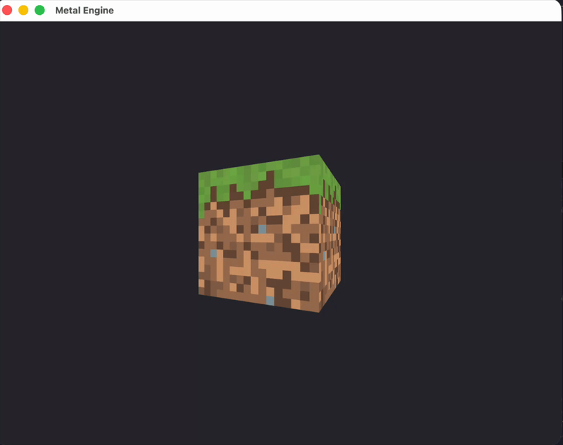
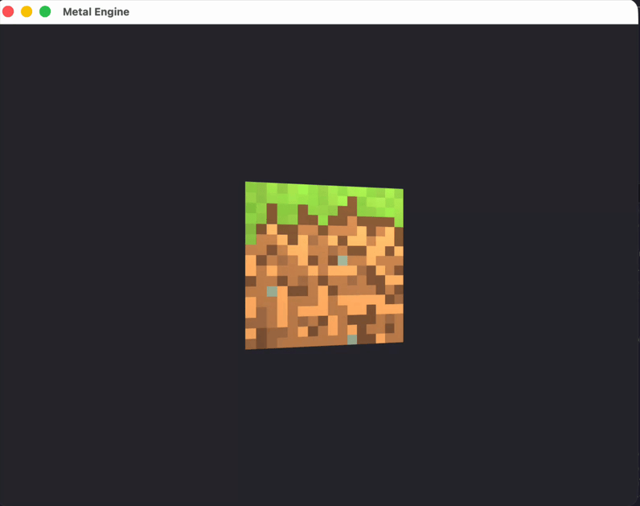
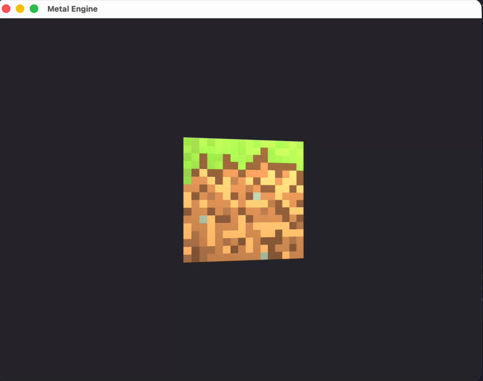
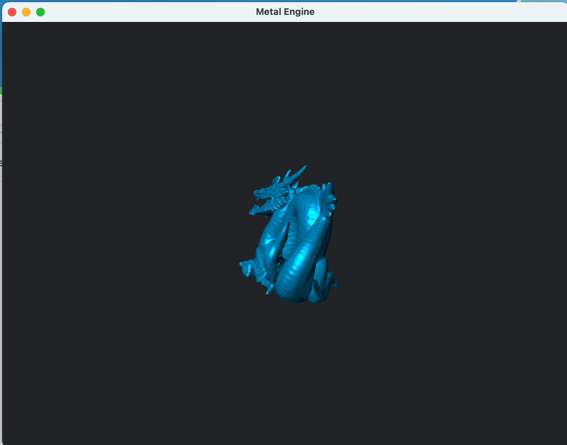
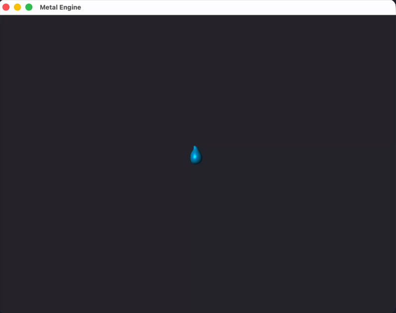

# Metal Tutorial C++ Clang Port

A port of the [metal-tutorial](https://metal-tutorial.com/) series in C++ but using CLang rather than XCode.

## Quick Start

You can clone and run the project below. Make sure to switch to specific tagged commits to run the different sections.
E.g lesson-01 will run the minecraft square, lesson-02 will run the 3D cube etc

> [!Important]
> It's important to clone recursively to get the submodules needed to run the repositry properly

```bash
git clone --recursive https://github.com/hreynier/minimal-metal-cpp.git
cd minimal-metal-cpp
./build.sh run
```

## Prerequisites

- macOS (Metal is Apple-exclusive) I've tested on macOS Sequoia v15.7.1 and Tahoe v26.0.1, ymmv
- CMake 3.28.0 or later
- Xcode Command Line Tools: `xcode-select --install`

## Build & Run

```bash
# Using build script (recommended)
./build.sh run          # Build and run
./build.sh clean        # Clean rebuild
./build.sh              # Build only

# Using CMake directly
mkdir -p build && cd build
cmake .. && cmake --build . --verbose
./minimal-metal-cpp
```

## Project Structure

```
src/
├── main.cpp                 # Entry point
├── mtl_engine.hpp/.cpp      # Metal rendering engine
├── mtl_implementation.cpp   # Metal-cpp bindings
├── assets                   # Various assets, like textures & 3d model files
└── shaders/*.metal   # Vertex & fragment shaders
```

## Tag Versions

Checkout the different tag versions below to target different lesson solutions from the tutorial series

### Lesson 01 – Simple textured square

`git checkout lesson-01 && ./build.sh run`



### Lesson 02 Part 1 – Simple 3D textured Cube

`git checkout lesson-02-1 && ./build.sh run`



### Lesson 02 Part 2 – 3D Textured Cube with Phong shading

`git checkout lesson02-02-phong && ./build.sh run`



### Lesson 02 Part 3 – 3D Textured Cube with Blinn-Phong shading

`git checkout lesson02-02-blinn-phong && ./build.sh run`



### Lesson 02 Part 4 – Blinn-Phong Sphere with lighting source

`git checkout lesson02-03-mars && ./build.sh run`


### Lesson 03 - Loading a .obj model

`git checkout lesson02-03-obj && ./build.sh run`



### Lesson 03 - Loading a .gltf model

`git checkout lesson02-03-gltf && ./build.sh run`


